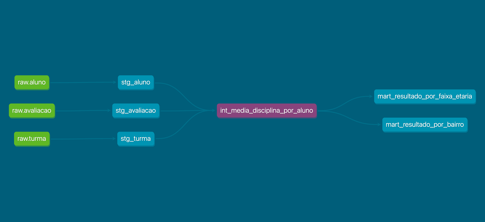

# Desafio dbt — dados educacionais (RMI)

Projeto **dbt Core + Postgres**: staging → intermediate → marts. Dados anonimizados (Parquets no GCS).

### Conteúdo desta entrega


| Tema                                                                                               | Onde no README                                    |
| -------------------------------------------------------------------------------------------------- | ------------------------------------------------- |
| Setup (Python, Docker, Postgres, carga, perfil dbt) e execução (`dbt deps`, `run`, `test`, `docs`) | Seções **1–7**                                    |
| Lineage e camadas                                                                                  | [Visão do lineage](#entrega-lineage)              |
| Materializações, convenções de nome, testes                                                        | [Decisões de arquitetura](#entrega-arquitetura)   |
| Compromissos assumidos                                                                             | [Trade-offs](#entrega-tradeoffs)                  |
| Próximos passos                                                                                    | [O que faria com mais tempo](#entrega-mais-tempo) |
| Esquema no Postgres, qualidade dos dados, marts e testes em detalhe                                | Seções **8–13**                                   |
| Análise exploratória dos dados                                | Seção **16**                                   |


---


## Visão do lineage

Os dados entram no warehouse pelo script `scripts/load_data.py`, que materializa as fontes no schema `**raw`** (variável `raw_schema`). O dbt referencia essas tabelas como **sources** e aplica três camadas lógicas.

**Fluxo em palavras.** Cada ficheiro Parquet vira uma tabela em `raw`. Os modelos `**stg_*`** (pasta `models/staging/`) são **views** no schema físico `staging` após tratamentos de tipos e colunas renomeadas. O modelo `**int_media_disciplina_por_aluno`** presente em `models/intermediate/`, é **ephemeral** (não cria objeto no Postgres). Por fim, `**mart_resultado_por_faixa_etaria`** e `**mart_resultado_por_bairro**` são **tabelas** no schema `marts`, agregando apenas o intermediate (médias por disciplina, regra de aprovação ≥ 5.0 e percentuais por faixa etária ou bairro).

**Ramo isolado.** `stg_escola` e `stg_frequencia` alimentam testes e possíveis análises futuras, mas **não** entram no DAG destes dois marts de resultado; o grão analítico dos marts é aluno × turma com notas, vindo de `stg_aluno`, `stg_turma` e `stg_avaliacao`.



Para o grafo interativo gerado pelo dbt: `dbt docs generate && dbt docs serve`.

---


## Decisões de arquitetura

**Materializações** (definidas em `dbt_project.yml` por pasta):

- **Staging:** `view` — baixo custo de armazenamento, dados sempre atualizados (freshness) e processamento rápido do pipeline.
- **Intermediate:** `ephemeral` — um único modelo (`int_media_disciplina_por_aluno`) reutilizado por dois marts, evitando tabela intermédia redundante, visto que o SQL já é o “contrato” entre staging e marts.
- **Marts:** `table` — quantidade de linhas é pouca o suficiente para não usar `incremental`, garantindo uma boa performance para os dados serem utilizados em BI.

**Convenções de nome**

- Prefixo `**stg_**`: uma view por fonte (aluno, avaliacao, etc)
- Prefixo `**int_**`: lógica de negócio e joins entre entidades do staging
- Prefixo `**mart_**`: agregações orientadas a KPIs.

As pastas espelham a camada (`models/staging`, `models/intermediate`, `models/marts`), o que simplifica `dbt run --select path:...`.

**Estratégia de testes**

- **Genéricos** em `schema.yml`: `not_null`, `unique`, `relationships`, `accepted_values`, `accepted_range`, `expression_is_true` — contrato por coluna e integridade referencial onde a fonte deveria respeitar o modelo de dados.
- **Singulares** em `tests/*.sql`: regras documentadas na seção **13**.
- **Expectativa operacional:** `dbt run` deve passar após a carga; `dbt test` no staging pode falhar porque os dados reais violam o contrato ideal, onde as falhas são tratadas como incosistências vindas da fonte (ver seção **9**).

---


## Trade-offs


| Decisão                                                                     | Benefício                                                                                        | Custo / risco                                                                                                                            |
| --------------------------------------------------------------------------- | ------------------------------------------------------------------------------------------------ | ---------------------------------------------------------------------------------------------------------------------------------------- |
| Intermediate **ephemeral**                                                  | Menos objetos no warehouse, DAG simples, alterações propagam-se sem refresh de tabela intermédia | Não é possível `SELECT` direto no intermediate nem inspecionar row counts no Postgres; depuração passa pelo SQL compilado ou pelos marts |
| KPIs só com **lingua_portuguesa, matematica e ciencias** e **bairro não nulo**            | Definição clara de população e comparabilidade entre marts                                       | Exclui a disciplina ingles, de modo que os percentuais não representam todos os alunos.                    |
| INNER JOIN (excluindo registros de avaliação que não têm aluno e turma associado)            | Definição clara de população garantindo que os dados são consistentes                                       | Perco registros na minha análise.                    |

---


## O que faria com mais tempo

- Sinalizar os registros que falham indicando qual a falha e se é True ou False em vez de apenas deixar o teste falhar. Outra opção seria adicionar a uma view para conseguir iterar sobre os registros.
- Criar mais um intermediate e um mart relacionado a **frequência** e **escola** (adicionar ao lineage).

---

## Pré-requisitos

- **Git**, **Python 3.10+**, **Docker** (opcional, para Postgres e/ou ambiente dbt).
- **Windows:** [Docker Desktop](https://docs.docker.com/desktop/setup/install/windows-install/) (WSL2 como backend é o cenário mais comum), **PowerShell 7+** ou **Git Bash** para comandos semelhantes ao bash; no **Prompt de Comando** (`cmd.exe`) os exemplos abaixo usam sintaxe `cmd` onde difere.
- Conta Google com acesso ao bucket **público** `gs://case_vagas/rmi/` (ou copiar os ficheiros por outro meio).

---

## 1. Clonar e ambiente Python

**macOS / Linux (bash)**

```bash
git clone <URL_DO_SEU_REPO> && cd <PASTA_DO_REPO>
python3 -m venv .venv
source .venv/bin/activate
pip install -r requirements.txt
```

**Windows (PowerShell, na pasta do repositório)**

```powershell
cd <PASTA_DO_REPO>
py -3.12 -m venv .venv   # ou: python -m venv .venv  (use a mesma versão 3.10+ que o projeto)
.\.venv\Scripts\Activate.ps1
pip install -r requirements.txt
```

Se `Activate.ps1` for bloqueado por política de execução, numa consola **PowerShell** (uma vez): `Set-ExecutionPolicy -Scope CurrentUser -ExecutionPolicy RemoteSigned`. Alternativa: **Prompt de Comando** → `cd` para a pasta do repo e `.\.venv\Scripts\activate.bat`.

*Não foi possível validar estes passos numa VM Windows daqui; seguem convenções oficiais da Microsoft/Google/Docker. Se algo falhar no teu PC, indica a versão do Windows e o terminal (PowerShell 5 vs 7, cmd, Git Bash).*

---

## 2. Postgres (Docker)

Na máquina host (porta **5432** livre). O mesmo comando funciona em **macOS, Linux e Windows** com Docker Desktop:

```bash
docker run -d --name postgres -e POSTGRES_PASSWORD=postgres -e POSTGRES_DB=desafio_rmi_ds -p 5432:5432 postgres:16
```

- **pgAdmin / dbt no host:** host `localhost`, porta `5432`, base `desafio_rmi_ds`, utilizador `postgres`, palavra-passe `postgres` (ajuste se mudar o `-e`).
- **Windows:** com Docker Desktop + WSL2, `localhost:5432` no Windows costuma chegar ao Postgres no contêiner; se não ligar, consulte a documentação do Docker Desktop sobre portas e firewall.
- **Remover:** `docker rm -f postgres` (e `docker rmi postgres:16` só depois de remover o contêiner).

---

## 3. Baixar Parquets para `data/`

Os ficheiros no bucket **não** têm extensão `.parquet` no nome do objeto.

**macOS / Linux (bash)**

```bash
mkdir -p data
# Se o gsutil reclamar de Python 3.13 no Mac (Cloud SDK):
export CLOUDSDK_PYTHON=/opt/homebrew/bin/python3.12   # ajuste ao seu python3.12
gsutil -m cp \
  "gs://case_vagas/rmi/aluno" \
  "gs://case_vagas/rmi/avaliacao" \
  "gs://case_vagas/rmi/escola" \
  "gs://case_vagas/rmi/frequencia" \
  "gs://case_vagas/rmi/turma" \
  data/
```

**Windows (PowerShell)** — com [Google Cloud SDK](https://cloud.google.com/sdk/docs/install-sdk#windows) instalado e `gsutil` no `PATH`:

```powershell
New-Item -ItemType Directory -Force -Path data | Out-Null
# Se o instalador do Cloud SDK usar um Python incompatível, aponte para um 3.10–3.12:
# $env:CLOUDSDK_PYTHON = "C:\Python312\python.exe"
gsutil -m cp `
  "gs://case_vagas/rmi/aluno" `
  "gs://case_vagas/rmi/avaliacao" `
  "gs://case_vagas/rmi/escola" `
  "gs://case_vagas/rmi/frequencia" `
  "gs://case_vagas/rmi/turma" `
  "data/"
```

(`data/` está no `.gitignore`; não versionar os binários.)

---

## 4. Docker — imagem com dbt

**Build** (na raiz do repositório):

```bash
docker build -t desafio-dbt:dev .
```

**Run** (monta o código em `/work`; Postgres no **host**):

- **macOS / Windows (Docker Desktop):** em geral **não** precisa de `--add-host`; use `host.docker.internal` no `profiles.yml` dentro do contêiner para falar com o Postgres no host.

```bash
docker run -it --rm --name desafio-dbt-dev -v "$PWD:/work" -w /work desafio-dbt:dev bash
```

**Windows (PowerShell)** — montar a pasta actual:

```powershell
docker run -it --rm --name desafio-dbt-dev -v "${PWD}:/work" -w /work desafio-dbt:dev bash
```

**Windows (cmd.exe)**

```bat
docker run -it --rm --name desafio-dbt-dev -v "%cd%:/work" -w /work desafio-dbt:dev bash
```

**Linux (Docker Engine no host):** costuma fazer falta resolver `host.docker.internal`:

```bash
docker run -it --rm --name desafio-dbt-dev \
  --add-host=host.docker.internal:host-gateway \
  -v "$PWD:/work" -w /work \
  desafio-dbt:dev bash
```

Dentro do contêiner: `cd /work` e, se o Postgres estiver no host, `host` em `profiles.yml` → `host.docker.internal`.

Alternativa de build: `docker build -f dbt-config/Dockerfile -t desafio-dbt:dev dbt-config` — ver `[dbt-config/README.md](dbt-config/README.md)`.

**Remover imagem/contêiner dbt:** `docker rm -f desafio-dbt-dev` → `docker rmi desafio-dbt:dev`.

---

## 5. Criar tabelas brutas no Postgres

O dbt lê **sources** no schema `**raw`** (variável `raw_schema` no `dbt_project.yml`).

**macOS / Linux (bash)**

```bash
export POSTGRES_HOST=localhost POSTGRES_USER=postgres POSTGRES_PASSWORD=postgres POSTGRES_DB=desafio_rmi_ds
# opcional: RAW_SCHEMA=raw DATA_DIR=./data
python scripts/load_data.py
```

**Windows (PowerShell)** — com o `.venv` ativo:

```powershell
$env:POSTGRES_HOST = "localhost"
$env:POSTGRES_USER = "postgres"
$env:POSTGRES_PASSWORD = "postgres"
$env:POSTGRES_DB = "desafio_rmi_ds"
# opcional: $env:RAW_SCHEMA = "raw"; $env:DATA_DIR = ".\data"
python scripts/load_data.py
```

**Windows (cmd.exe)**

```bat
set POSTGRES_HOST=localhost
set POSTGRES_USER=postgres
set POSTGRES_PASSWORD=postgres
set POSTGRES_DB=desafio_rmi_ds
python scripts\load_data.py
```

Cria o schema se precisar e as tabelas `aluno`, `escola`, `turma`, `frequencia`, `avaliacao`. O script usa `**RAW_SCHEMA**` (padrão `**raw**`), alinhado a `vars.raw_schema` no dbt.

---

## 6. Perfil dbt (`profiles.yml`)

- **Nome do profile:** `desafio_rmi_ds` (igual a `profile:` no `dbt_project.yml`).
- **macOS / Linux:** copie `dbt-config/.dbt/profiles.yml` para `~/.dbt/profiles.yml` **ou** use `profiles.yml.example` como modelo.
- **Windows:** pasta do dbt no utilizador → `%USERPROFILE%\.dbt\` (ex.: `C:\Users\TuNome\.dbt\`). Crie a pasta se não existir e copie o ficheiro, por exemplo no PowerShell: `New-Item -ItemType Directory -Force -Path "$env:USERPROFILE\.dbt" | Out-Null` e `Copy-Item -Force "dbt-config\.dbt\profiles.yml" "$env:USERPROFILE\.dbt\profiles.yml"`.
- Ajuste **host**, **password** e **dbname** se necessário. O ficheiro no repo usa **valores literais** (sem `env_var`).
- `**schema` no profile (dev):** usado para models **sem** `+schema` literal na macro (ver `generate_schema_name.sql`). Os `stg_*` usam `**+schema: staging`** e, em dev, o schema físico é só `**staging**` (não `{{ target.schema }}_staging`). Pode ser diferente de `vars.raw_schema` (tabelas brutas). Em `**--target prod**` use outro `target.schema` (ex.: `desafio_rmi_ds_prod`).

---

## 7. dbt (na raiz do repo, com `.venv` ativo)

```bash
dbt deps
dbt debug
dbt run
dbt test
dbt docs generate && dbt docs serve
```

**Windows (PowerShell 5.1):** o operador `&&` pode não existir; use duas linhas ou, no PowerShell 7+, `dbt docs generate; if ($?) { dbt docs serve }`.

- **Perfil sem copiar para `~/.dbt` / `%USERPROFILE%\.dbt`:** antes de `dbt`, defina o directório de perfis:
  - **macOS / Linux:** `export DBT_PROFILES_DIR="$PWD/dbt-config/.dbt"`
  - **Windows (PowerShell):** `$env:DBT_PROFILES_DIR = (Join-Path $PWD "dbt-config\.dbt")`
  - **Windows (cmd.exe):** `set DBT_PROFILES_DIR=%cd%\dbt-config\.dbt`
- **Só staging:** `dbt run --select path:models/staging`
- **Só intermediate:** `dbt run --select path:models/intermediate`
- **Só marts:** `dbt run --select path:models/marts`
- **Só testes singulares em `tests/`:** `dbt test --select path:tests`
- `dbt compile` não cria objetos no warehouse; só `dbt run` / `dbt build`.

Neste extract público, `**dbt test` pode falhar** em testes de qualidade do staging (`not_null`, `relationships`, `unique`, etc.) por inconsistências já descritas em **§9** — não indica por si só que o ambiente ou os passos 1–6 estão errados. `**dbt run`** deve concluir com sucesso após a carga em **§5**. `dbt docs serve` abre um servidor local (Ctrl+C para sair).

---

## 8. Postgres (Estrutura)


| O quê                         | Onde                                                                                        |
| ----------------------------- | ------------------------------------------------------------------------------------------- |
| Tabelas brutas (carga Python) | schema `**vars.raw_schema`** (padrão `**raw`**; ver `dbt_project.yml`)                      |
| Views `**stg_*`** (dev)       | schema físico `**staging`** (`+schema: staging`; macro dev não prefixa com `target.schema`) |
| Tabelas `**mart_*`**          | schema físico `**marts`** (separado do schema dos dados brutos)                             |
| **Intermediate** `ephemeral`  | sem tabela/view no Postgres (SQL inlinado nos downstream)                                   |
| **prod**                      | `stg_*` em `**{target.schema}_staging`**; `**mart_*`** no schema `**marts**`                |


---

## 9. Resultado dos testes (staging) e padronização

### O que foi padronizado na camada staging

- **Tipos explícitos** nos `stg_*`: conversões com `::text`, `::bigint`, `::date`, `::float` (conforme o model), alinhando a tipagem às descrições em `models/staging/schema.yml`.
- **Nomes de colunas legíveis** em `stg_avaliacao`: as disciplinas `disciplina_1`…`disciplina_4` passam a se chamar `lingua_portuguesa`, `ciencias`, `ingles`, `matematica`.

### Inconsistências encontradas nos dados

Ao executar os testes em `**stg_aluno`** foram encontradas as seguintes inconsistências (refletem a fonte `aluno` após o mesmo pipeline de staging):

- `**id_turma`:** nem todos os alunos têm turma associada.
- `**bairro`:** nem todos os alunos têm bairro associado.
- **68** linhas não distintas

Ao executar os testes em `**stg_frequencia`** foram encontradas as seguintes inconsistências (refletem a fonte `frequencia` após o mesmo pipeline de staging):

- **1469** linhas não distintas
- **id_turma:** com 338536 registros que não estão associados a um id_turma de `**stg_turma`**

Ao executar os testes em `**stg_avaliacao`** foram encontradas as seguintes inconsistências (refletem a fonte `avaliacao` após o mesmo pipeline de staging):

- `**ciencias`:** nem todos os alunos têm nota de ciencias associada (35931 dados nulos).
- `**ingles`:** nem todos os alunos têm nota de ingles associada (221687 dados nulos).
- `**matematica`:** nem todos os alunos têm nota de matematica associada (35462 dados nulos).
- `**lingua_portuguesa`:** nem todos os alunos têm nota de lingua_portuguesa associada (34609 dados nulos).
- `**frequencia`:** nem todos os alunos têm frequencia associada (1734 dados nulos).
- **34** linhas não distintas
- **id_turma:** com 184 registros que não estão associados a um id_turma de `**stg_turma`**

---

## 10. Marts de resultado (`mart_resultado_por_faixa_etaria`, `mart_resultado_por_bairro`)

### Definições (percentuais, período, população)


| Tema                    | Definição usada neste projeto                                                                                                                                                                                                                                                                                                                                                                                                           |
| ----------------------- | --------------------------------------------------------------------------------------------------------------------------------------------------------------------------------------------------------------------------------------------------------------------------------------------------------------------------------------------------------------------------------------------------------------------------------------- |
| **Percentuais (0–100)** | Em cada grupo (`faixa_etaria` ou `bairro`), `pct_*` = contagem de linhas com `resultado_*` = Aprovado ou Reprovado dividida por `total_alunos` do mesmo grupo (`× 100`, arredondado a 2 casas). `total_alunos` é o número de linhas **aluno × turma** em `int_media_disciplina_por_aluno` naquele grupo. **Não** há limiar de **75%** nos modelos: o corte de aprovação é média ≥ **5,0** (escala 0–10) por disciplina no intermediate. |
| **Período**             | **Sem** filtro de datas explícito nos marts ou no `int_media_disciplina_por_aluno`. As médias são calculadas sobre **todas** as linhas de avaliação distintas do extract que passam nos filtros (em geral todos os bimestres presentes na fonte `raw.avaliacao`).                                                                                                                                                                       |
| **População incluída**  | Alunos presentes em `stg_aluno` **e** `stg_turma` na chave `(id_aluno, id_turma)`, com `**lingua_portuguesa`**, `**matematica`** e `**ciencias**` não nulas em `stg_avaliacao`; `**bairro` não nulo** em `stg_aluno`. Inglês não entra. Cada linha do intermediate = um par aluno×turma com médias e resultados binários por disciplina.                                                                                                |
| **Mart por bairro**     | Igual à população acima, agregada por `bairro`. O SQL actual **não** aplica `having` extra: todos os bairros presentes no intermediate aparecem na mart.                                                                                                                                                                                                                                                                                |


### O que estes marts **não** medem

- **Frequência** (`stg_frequencia`) e vínculo detalhado com **escola** (além do que já está implícito no cadastro).
- **Inglês** e qualquer disciplina fora lingua_portuguesa / matemática / ciências no intermediate.
- Alunos **sem** as três notas, **sem** turma válida no inner join, ou **sem** `bairro` (ficam fora do pipeline destes marts).
- **Comparação entre anos** ou séries temporais (não há partição por ano no mart).
- **Inferência** para fora da amostra, intervalos de confiança ou causalidade (ex.: desempenho “por bairro” não implica efeito do bairro).

### Análise - `mart_resultado_por_bairro`

A mart contém **771** bairros; na tabela, os **cinco** com maior `total_alunos` (linhas aluno×turma), por ordem decrescente, e o % de aprovação por disciplina.


| `bairro`             | `total_alunos` | Língua portuguesa (% aprov.) | Matemática (% aprov.) | Ciências (% aprov.) |
| -------------------- | -------------- | ---------------------------- | --------------------- | ------------------- |
| -6888326179602323732 | 3038           | 85,45%                       | 76,86%                | 77,91%              |
| -1679083123460691310 | 2906           | 86,72%                       | 79,49%                | 83,28%              |
| -2784322559717078693 | 2176           | 75,23%                       | 67,37%                | 71,83%              |
| 7225990828785393240  | 1922           | 82,10%                       | 75,44%                | 78,82%              |
| 20322782284730250    | 1625           | 84,74%                       | 78,28%                | 81,85%              |


Para reproduzir: `select * from marts.mart_resultado_por_bairro order by total_alunos desc limit 5;` (schema `**marts`** após `dbt run`).

### Análise - `mart_resultado_por_faixa_etaria`

A mart contém **3** faixas etárias presentes no extract (`11-14`, `15-17`, `18+`). Abaixo, `total_alunos` é o número de linhas aluno×turma por faixa (mesmo significado que na mart) e as restantes colunas são os `pct_alunos_aprovados_*`.


| `faixa_etaria` | `total_alunos` | Língua portuguesa (% aprov.) | Matemática (% aprov.) | Ciências (% aprov.) |
| -------------- | -------------- | ---------------------------- | --------------------- | ------------------- |
| 11-14          | 4108           | 63,49%                       | 58,08%                | 62,66%              |
| 15-17          | 44301          | 84,64%                       | 74,59%                | 80,24%              |
| 18+            | 2414           | 65,99%                       | 63,96%                | 65,00%              |


Para reproduzir: `select * from marts.mart_resultado_por_faixa_etaria order by faixa_etaria;` (schema `**marts`** após `dbt run`).

### Dependências

Ambos os marts agregam **só** `int_media_disciplina_por_aluno` (notas + cadastro + turma). **Não** usam `stg_frequencia` nem `stg_escola` diretamente.


| Camada           | Model                             | Chaves / colunas usadas                                                                                                 |
| ---------------- | --------------------------------- | ----------------------------------------------------------------------------------------------------------------------- |
| **Mart**         | `mart_resultado_por_faixa_etaria` | Lê `int_media_disciplina_por_aluno`; agrupa por `**faixa_etaria`**; percentuais a partir de `resultado_*`.              |
| **Mart**         | `mart_resultado_por_bairro`       | Lê o mesmo intermediate; agrupa por `**bairro`**.                                                                       |
| **Intermediate** | `int_media_disciplina_por_aluno`  | Grão `**(id_aluno, id_turma, faixa_etaria, bairro)`**; médias de lingua_portuguesa, matemática e ciências; regra ≥ 5,0. |
| **Staging**      | `stg_avaliacao`                   | `**id_aluno`**, `**id_turma`**; `**lingua_portuguesa**`, `**matematica**`, `**ciencias**` (filtro: as três não nulas).  |
| **Staging**      | `stg_aluno`                       | `**id_aluno`**, `**id_turma`**, `**faixa_etaria**`, `**bairro**` (com `bairro is not null` no intermediate).            |
| **Staging**      | `stg_turma`                       | `**id_aluno`**, `**id_turma`** (inner join com avaliação).                                                              |


**Joins no intermediate:** `al.id_aluno = av.id_aluno` e `al.id_turma = av.id_turma`; o mesmo par `**(id_aluno, id_turma)`** para `turma_sem_duplicados`.

**Materializar antes de testar:** `dbt build --select mart_resultado_por_faixa_etaria mart_resultado_por_bairro` (ou `dbt run` nesses models e depois `dbt test`).

---

## 11. Testes genéricos

São os testes declarados **por coluna** nos `schema.yml` do dbt (`models/staging/schema.yml`, `models/marts/schema.yml`): `not_null`, `unique`, `relationships`, `accepted_values`, `accepted_range`, expressões (`expression_is_true`), combinações únicas, etc. Correm com `dbt test` e falham quando os dados violam o contrato (órfãos, duplicados, fora de domínio). Funcionam como rede de qualidade: apanham-nos cedo o que quebra integridade ou o que faria relatórios e KPIs mentirosos, sem escreveres um `SELECT` de auditoria para cada regra.

## 12. Testes nas marts e no staging

### Testes nas marts

Justificativas dos testes em `models/marts/schema.yml` (texto apenas neste README).

#### `mart_resultado_por_faixa_etaria`


| Coluna                                    | Teste                         | Por quê                                                                              |
| ----------------------------------------- | ----------------------------- | ------------------------------------------------------------------------------------ |
| `faixa_etaria`                            | `not_null`                    | PK lógica da mart.                                                                   |
| `faixa_etaria`                            | `unique`                      | Uma linha por faixa, onde duplicata duplica KPIs.                                    |
| `faixa_etaria`                            | `accepted_values`             | Somente valores coerentes com os esperados em `stg_aluno`.                           |
| `faixa_etaria`                            | `relationships` → `stg_aluno` | Cada faixa publicada existe no cadastro; verificação por inclusão                    |
| `total_alunos`                            | `not_null`                    | Denominador dos `pct_`*.                                                             |
| `total_alunos`                            | `accepted_range` (≥ 0)        | Total de alunos não pode ser negativo.                                               |
| `pct_alunos_aprovados_lingua_portuguesa`  | `not_null`                    | O percentual de aprovados precisa somar 100% ao somar com o percentual e reprovados. |
| `pct_alunos_aprovados_lingua_portuguesa`  | `accepted_range` [0, 100]     | O percentual não pode ser negativo nem, utrapassar 100%.                             |
| `pct_alunos_reprovados_lingua_portuguesa` | `not_null`                    | Par com aprovados; regra binária no upstream implica soma 100%.                      |
| `pct_alunos_reprovados_lingua_portuguesa` | `accepted_range` [0, 100]     | O percentual não pode ser negativo nem, utrapassar 100%.                             |
| `pct_alunos_aprovados_matematica`         | `not_null`                    | O percentual de aprovados precisa somar 100% ao somar com o percentual e reprovados. |
| `pct_alunos_aprovados_matematica`         | `accepted_range` [0, 100]     | O percentual não pode ser negativo nem, utrapassar 100%.                             |
| `pct_alunos_reprovados_matematica`        | `not_null`                    | O percentual de reprovados precisa somar 100% ao somar com o percentual e aprovados. |
| `pct_alunos_reprovados_matematica`        | `accepted_range` [0, 100]     | O percentual não pode ser negativo nem, utrapassar 100%.                             |
| `pct_alunos_aprovados_ciencias`           | `not_null`                    | O percentual de aprovados precisa somar 100% ao somar com o percentual e reprovados. |
| `pct_alunos_aprovados_ciencias`           | `accepted_range` [0, 100]     | O percentual não pode ser negativo nem, utrapassar 100%.                             |
| `pct_alunos_reprovados_ciencias`          | `not_null`                    | O percentual de reprovados precisa somar 100% ao somar com o percentual e aprovados. |
| `pct_alunos_reprovados_ciencias`          | `accepted_range` [0, 100]     | O percentual não pode ser negativo nem, utrapassar 100%.                             |


#### `mart_resultado_por_bairro`


| Coluna                                    | Teste                         | Por quê                                                                              |
| ----------------------------------------- | ----------------------------- | ------------------------------------------------------------------------------------ |
| `bairro`                                  | `not_null`                    | PK lógica da mart.                                                                   |
| `bairro`                                  | `unique`                      | Uma linha por faixa, onde duplicata duplica KPIs.                                    |
| `bairro`                                  | `relationships` → `stg_aluno` | O bairro deve ser condizente com o bairro do aluno.                                  |
| `total_alunos`                            | `not_null`                    | Total de alunos não pode ser negativo.                                               |
| `total_alunos`                            | `accepted_range` (≥ 1)        | Bairro na mart implica ≥ 1 linha aluno×turma no pipeline.                            |
| `pct_alunos_aprovados_lingua_portuguesa`  | `not_null`                    | O percentual de aprovados precisa somar 100% ao somar com o percentual e reprovados. |
| `pct_alunos_aprovados_lingua_portuguesa`  | `accepted_range` [0, 100]     | O percentual não pode ser negativo nem, utrapassar 100%.                             |
| `pct_alunos_reprovados_lingua_portuguesa` | `not_null`                    | O percentual de aprovados precisa somar 100% ao somar com o percentual e reprovados. |
| `pct_alunos_reprovados_lingua_portuguesa` | `accepted_range` [0, 100]     | O percentual não pode ser negativo nem, utrapassar 100%.                             |
| `pct_alunos_aprovados_matematica`         | `not_null`                    | O percentual de aprovados precisa somar 100% ao somar com o percentual e reprovados. |
| `pct_alunos_aprovados_matematica`         | `accepted_range` [0, 100]     | O percentual não pode ser negativo nem, utrapassar 100%.                             |
| `pct_alunos_reprovados_matematica`        | `not_null`                    | O percentual de aprovados precisa somar 100% ao somar com o percentual e reprovados. |
| `pct_alunos_reprovados_matematica`        | `accepted_range` [0, 100]     | O percentual não pode ser negativo nem, utrapassar 100%.                             |
| `pct_alunos_aprovados_ciencias`           | `not_null`                    | O percentual de aprovados precisa somar 100% ao somar com o percentual e reprovados. |
| `pct_alunos_aprovados_ciencias`           | `accepted_range` [0, 100]     | O percentual não pode ser negativo nem, utrapassar 100%.                             |
| `pct_alunos_reprovados_ciencias`          | `not_null`                    | O percentual de aprovados precisa somar 100% ao somar com o percentual e reprovados. |
| `pct_alunos_reprovados_ciencias`          | `accepted_range` [0, 100]     | O percentual não pode ser negativo nem, utrapassar 100%.                             |


### Testes no staging

Mesmo formato (**Coluna / Teste / Por quê**); declarações em `models/staging/schema.yml`.

#### `stg_aluno`


| Coluna         | Teste                                                                              | Por quê                                                                                                                                |
| -------------- | ---------------------------------------------------------------------------------- | -------------------------------------------------------------------------------------------------------------------------------------- |
| *(modelo)*     | `unique_combination_of_columns` (`id_aluno`, `id_turma`, `faixa_etaria`, `bairro`) | Garante grão estável da carga transformada; duplicata quebra joins e contagens.                                                        |
| `id_aluno`     | `not_null`                                                                         | Identificador mínimo para qualquer vínculo a turma ou notas.                                                                           |
| `id_aluno`     | `unique`                                                                           | Um registo por aluno no cadastro (grão do `stg_aluno`).                                                                                |
| `id_turma`     | `not_null`                                                                         | Turma obrigatória para alinhar com `stg_turma` e `stg_avaliacao`.                                                                      |
| `faixa_etaria` | `not_null`                                                                         | Usada em marts e `int_media_`*; null impede agregação por faixa.                                                                       |
| `faixa_etaria` | `accepted_values`                                                                  | Evita literais fora do conjunto de negócio / privacidade.                                                                              |
| `bairro`       | `not_null` (com limiares)                                                          | Sinaliza volume de ausência de bairro; a pipeline analítica pode filtrar `bairro` não nulo — útil para monitorizar qualidade da fonte. |


#### `stg_escola`


| Coluna      | Teste                                                   | Por quê                                                                                                          |
| ----------- | ------------------------------------------------------- | ---------------------------------------------------------------------------------------------------------------- |
| *(modelo)*  | `unique_combination_of_columns` (`id_escola`, `bairro`) | Grão da escola + hash de localização sem duplicar unidades.                                                      |
| `id_escola` | `not_null`                                              | Chave para `stg_frequencia.id_escola`.                                                                           |
| `id_escola` | `unique`                                                | Uma linha por escola.                                                                                            |
| `bairro`    | `not_null`                                              | Completa o grão testado na combinação; necessário para joins de frequência à escola.                             |
| `bairro`    | `unique`                                                | Contrato da carga actual (um bairro por linha de escola neste extract); violação indica colisão ou erro de hash. |


#### `stg_turma`


| Coluna     | Teste                                                           | Por quê                                                          |
| ---------- | --------------------------------------------------------------- | ---------------------------------------------------------------- |
| *(modelo)* | `unique_combination_of_columns` (`ano`, `id_turma`, `id_aluno`) | Um víncio aluno×turma×ano por linha; duplicata inflaciona joins. |
| `ano`      | `not_null`                                                      | Ano anonimizado deve estar presente.                             |
| `ano`      | `accepted_values` [2000]                                        | Garante anonimização determinística esperada pelo projeto.       |
| `id_turma` | `not_null`                                                      | Chave com `id_aluno` para avaliação e frequência.                |
| `id_aluno` | `not_null`                                                      | Aluno da matrícula tem de existir.                               |
| `id_aluno` | `unique`                                                        | Um víncio turma por aluno neste model (regra do extract).        |
| `id_aluno` | `relationships` → `stg_aluno`                                   | Matrícula só para alunos cadastrados; evita órfãos.              |


#### `stg_frequencia`


| Coluna        | Teste                                                                         | Por quê                                                            |
| ------------- | ----------------------------------------------------------------------------- | ------------------------------------------------------------------ |
| *(modelo)*    | `expression_is_true` (`data_inicio` em 2000)                                  | Valida que as datas estão de de acordo com o ano aninimizado       |
| *(modelo)*    | `expression_is_true` (`data_fim` em 2000)                                     | Valida que as datas estão de de acordo com o ano aninimizado       |
| *(modelo)*    | `unique_combination_of_columns` Evita duplicar o mesmo registo de frequência. |                                                                    |
| `id_escola`   | `not_null`                                                                    | O id da escola deve ser preenchido, pois é uma FK                  |
| `id_escola`   | `relationships` → `stg_escola`                                                | Sem id deescola não é possível cruzar os dados com a tabela escola |
| `id_aluno`    | `not_null`                                                                    | O id do aluno deve ser preenchido, pois é uma FK                   |
| `id_aluno`    | `relationships` → `stg_aluno`                                                 | Sem id de aluno não é possível cruzar os dados com a tabela aluno  |
| `id_turma`    | `not_null`                                                                    | O id da turma deve ser preenchido, pois é uma FK                   |
| `id_turma`    | `relationships` → `stg_turma`                                                 | Sem id de turma não é possível cruzar os dados com a tabela turma  |
| `data_inicio` | `not_null`                                                                    | Início do período é obrigatório.                                   |
| `data_fim`    | `not_null`                                                                    | Fim do período é obrigatório.                                      |
| `disciplina`  | `not_null`                                                                    | A frequência precisa ser associada a uma disciplina                |
| `disciplina`  | `accepted_values`                                                             | Evita valores não mapeados                                         |
| `frequencia`  | `not_null`                                                                    | Percentual obrigatório no contrato de staging.                     |
| `frequencia`  | `accepted_range` [0, 100]                                                     | Evita valores não mapeados e inválidos                             |


#### `stg_avaliacao`


| Coluna              | Teste                                                                | Por quê                                                                          |
| ------------------- | -------------------------------------------------------------------- | -------------------------------------------------------------------------------- |
| *(modelo)*          | `unique_combination_of_columns` (`id_aluno`, `id_turma`, `bimestre`) | Um registo por aluno×turma×bimestre; duplicata distorce médias no `int_media_`*. |
| `id_aluno`          | `not_null`                                                           | Chave de join com aluno e turma.                                                 |
| `id_aluno`          | `relationships` → `stg_aluno`                                        | Avaliação só deve existir para alunos matriculados.                              |
| `id_turma`          | `not_null`                                                           | Chave de join com turma.                                                         |
| `id_turma`          | `relationships` → `stg_turma`                                        | Avaliação só deve existir para turmas registradas.                               |
| `frequencia`        | `not_null`                                                           | Campo presente no contrato de notas por bimestre.                                |
| `frequencia`        | `accepted_range` [0, 100]                                            | Evita valores não mapeados e inválidos                                           |
| `bimestre`          | `not_null`                                                           | Partição temporal do modelo.                                                     |
| `bimestre`          | `accepted_range` [1, 4]                                              | Domínio de bimestres escolares.                                                  |
| `lingua_portuguesa` | `accepted_range` [0, 10]                                             | Evita valores não mapeados e inválidos                                           |
| `ciencias`          | `accepted_range` [0, 10]                                             | Evita valores não mapeados e inválidos                                           |
| `ingles`            | `accepted_range` [0, 10]                                             | Evita valores não mapeados e inválidos                                           |
| `matematica`        | `accepted_range` [0, 10]                                             | Evita valores não mapeados e inválidos                                           |


---

## 13. Testes singulares (`tests/`)

Ficheiros SQL na pasta `tests/` que o dbt trata como testes de **“falha se devolver linhas”**. Em geral: `dbt run --select` nos `stg_`* que o SQL referencia, depois `dbt test --select path:tests`.

`**assert_data_inicio_data_fim.sql`** — Cada janela de frequência tem de ter **fim depois do início**. Quebra com `(data_inicio, data_fim)` distintos em que `data_fim` não é maior que `data_inicio`. Importa porque período inválido não sustenta métricas por intervalo nem presença.

`**assert_data_inicio_por_mes.sql`** — Lista global ordenada de `data_inicio` distintas (com `data_fim` para desempate); onde existe “próxima” linha, o próximo início tem de ser **estritamente maior** que o actual. Quebra se o calendário de períodos publicados repete ou retrocede. Útil como sanity check temporal; não é por turma — é ordem nos distintos.

`**assert_datas_coerentes_ano_turma.sql`** — Cruza frequência com turma e exige que o **ano civil** de `data_inicio` e `data_fim` coincida com o `**ano` da turma**. Quebra quando há desalinhamento. Importa para cruzar cadastro de turma com apuração; no extract actual o ano vem anonimizado (2000), mas o teste **amarra** as duas fontes.

---

## 14. Estrutura útil do repositório

Inventário de **PKs, FKs, enums e campos obrigatórios** por model (`stg_`*, `mart_`*): `[docs/model_contracts.md](docs/model_contracts.md)`.

```
models/staging/     # stg_* + _sources.yml
models/intermediate/
models/marts/
docs/model_contracts.md
scripts/load_data.py
dbt-config/.dbt/profiles.yml
Dockerfile
dbt_project.yml
```

---

## 15. Pacotes dbt

Se usar `packages.yml`: `dbt deps` antes de `dbt run`.

---

## 16. Análise exploratória de dados (EDA)

O notebook [notebooks/eda.ipynb](notebooks/eda.ipynb) aplica o carregamento dos **Parquet** com **Polars**, tabelas descritivas e gráficos (por exemplo, Matplotlib/Seaborn) sobre o mesmo `data/` descrito em **3. Baixar Parquets para `data/`** (acima).

**Pré-requisitos**

- Dados em `data/` (pastas com Parquet, por exemplo `aluno`, `avaliacao`, `escola`, `frequencia`, `turma`).
- O ambiente virtual do projeto (seção **1. Clonar e ambiente Python** acima) ativo.

**Instalação das dependências do EDA**

s primeiras células do notebook contém as bibliotecas necessárias e os comandos para instalá-las.

**Caminhos**

As células de leitura usam caminhos relativos do tipo `../data/<pasta>`. Abre o ficheiro a partir de `notebooks/eda.ipynb` e **usa como pasta de trabalho do kernel a pasta `notebooks/`** (comportamento habitual no Cursor, VS Code ou Jupyter quando o notebook está nessa pasta), para que `..` aponte correctamente à raiz do repositório.

**Como executar**

1. Abrir `notebooks/eda.ipynb` e executar as células **por ordem** (ou “Run All”), a partir do topo, para respeitar imports e o fluxo de leitura dos dados.
2. Opcional, pela linha de comando: após `pip install jupyter`, a partir da raiz do repositório podes fazer `jupyter notebook notebooks/eda.ipynb` (ou `jupyter lab`) e abrir o mesmo ficheiro no browser.

---

